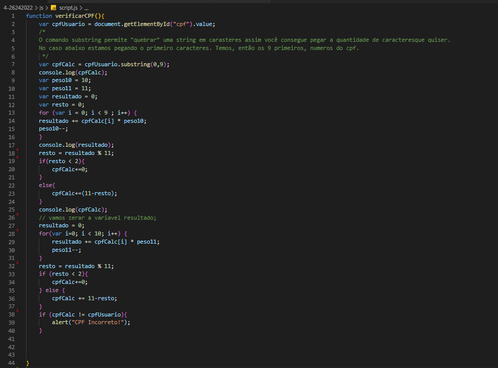

# Estudo Javascript

## Trabalhando com a estrutura básica do Javascript

## 

### Sumário

    * Introdução ao Javascript
    * Elementos da introdução
        - Criação de variáveis
        - Criação de constantes
    *Forma de utilização no html

```javascript
<script>alert("Olá mundo");</script>
```

Outro exemplo de aplicação do Javascript

```html
<html>
  <head>
    <title>Exemplo</title>
  </head>
  <body>
    <script>
      console.log("Olá Mundo");
    </script>
  </body>
</html>
```

#### Cálculo do CPF em Javascript


